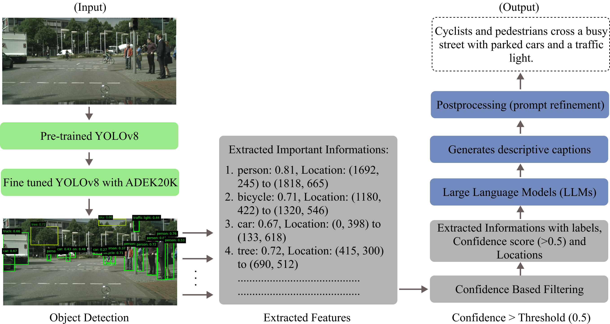
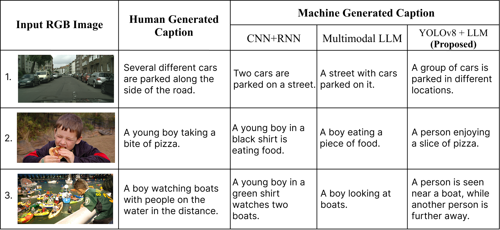

# A Framework for Accurate and Efficient Image Captioning by Fusing Fine-Tuned YOLOv8 and LLMs 

## Overview
Automatic image captioning is essential for generating natural language descriptions by extracting meaningful features and understanding contextual relationships in images. While traditional methods like CNN-RNN models struggle with computational complexity and spatial awareness, multimodal Large Language Models (LLMs) offer an alternative but often lack object precision and are computationally expensive. In this work, we propose a novel image captioning framework that combines a finetuned YOLOv8 model with an LLM for efficient and accurate caption generation. YOLOv8 detects objects, extracts their names, confidence scores, and bounding box coordinates, which are filtered based on confidence levels above 0.5 before being passed to the LLM. This integration results in richer, more contextually accurate captions with lower inference time compared to existing methods. We evaluate our approach against multimodal LLMs and CNN-RNN models, demonstrating that it significantly improves efficiency while maintaining high caption quality. This method provides a promising solution for real-time applications, offering faster and more reliable image captioning for systems such as autonomous technologies and content generation.
 The model architecture is like this: 
#### Model Architecture:
 

## Quickstart the project
1. Download the code in `ZIP` or open with `GitHub Desktop` or `https://github.com/dabbrata/Caption_Generation_LLM.git`.
2. Then import `yolov8-llm-caption.ipynb` file to your notebook.
3. Install required python dependencies into your python environment / virtual environment using `pip install -r Requirements.txt`.
4. Run all the cells of that imported (.ipynb) file.

## Dataset
The dataset to fine tune YOLOv8: 
The [dataset](https://www.kaggle.com/datasets/awsaf49/ade20k-dataset) used to fine-tune the YOLOv8 model was ADE20K, which contains a wide range of object classes. For our study, we selected and utilized only a subset of these classes relevant to our objectives.

## Procedure
The proposed image captioning framework begins by passing an input image through a fine-tuned YOLOv8 model, which detects objects and extracts their class names, confidence scores, and bounding box coordinates. Detections with confidence scores above 0.5 are retained and used to create a structured textual prompt that captures the object names and their spatial relationships. This prompt is then fed into a Large Language Model (LLM), which generates a contextually rich and coherent natural language caption. By leveraging YOLOv8’s efficient object detection and the LLM’s language understanding, the framework produces accurate captions with reduced inference time compared to traditional CNN-RNN and multimodal LLM-based approaches.

## Results
 

## Links and References
- Paper: https://openaccess.thecvf.com/content/WACV2024/papers/Rotstein_FuseCap_Leveraging_Large_Language_Models_for_Enriched_Fused_Image_Captions_WACV_2024_paper.pdf
- ADE20K Dataset: https://www.kaggle.com/datasets/awsaf49/ade20k-dataset

## Licensing
The code in this project is licensed under [MIT License](LICENSE).
